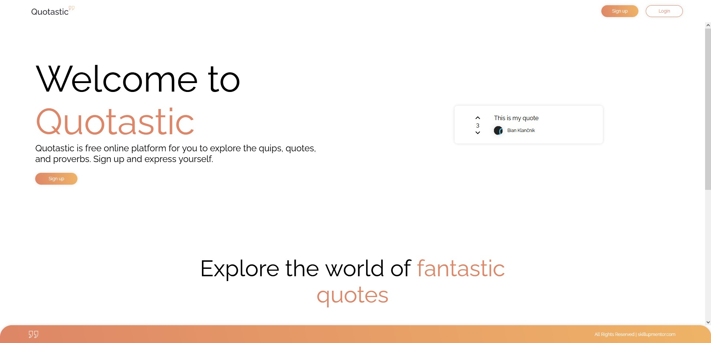

# Quotastic (SkillUp Mentor)

Link to website: http://quote-frontend.s3-website.eu-central-1.amazonaws.com/

### Table of Contents

- [Description](#description)
- [How To Use](#how-to-use)
- [References](#references)
- [Stay In Touch](#stay-in-touch)

---

## Description

Full-stack application for users to create and publish quotes. Users can also view other users quotes and upvote/downvote them.
Application also allows you to sign up if you don't have an account yet.
You can edit your account info and also add, edit or delete your quotes.

---

**Home page**


## Technologies

- HTML
- CSS
- JavaScript
- Typescript
- NodeJS
- ReactJS
- NestJS
- ExpressJS
- PostgreSQL
- TypeORM
- AWS
- Docker
- Figma
- Git
- Github

---

## How To Use

#### Installation

Clone this repository and run:

```bash
# install dependencies
$ npm i
```

#### Running the app

```bash
# development
$ npm start
```

---

## References

- SkillUp Mentor - [skillupmentor](https://skillupmentor.com/)

## Stay in touch

- Author - [Bian Klančnik](https://www.linkedin.com/in/bian-klan%C4%8Dnik-7b611815a/?originalSubdomain=si)
